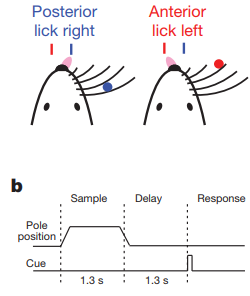

# Li 2015 and Li-Daie 2016

This project describes the two studies:

>Nuo Li, Tsai-Wen Chen, Zengcai V. Guo, Charles R. Gerfen & Karel Svoboda. "A motor cortex circuit for motor planning and movement" (2015) Nature (https://dx.doi.org/10.1038/nature14178)

The original data are available at: https://crcns.org/data-sets/motor-cortex/alm-1

>Nuo Li, Kayvon Daie, Karel Svoboda & Shaul Druckmann. "Robust neuronal dynamics in premotor cortex during motor planning" (2016) Nature (https://dx.doi.org/10.1038/nature17643)

The original data are available at: https://crcns.org/data-sets/motor-cortex/alm-3

The data include extracellular recordings from the *anterior lateral motor* cortex (ALM).  The recordings were collected from mice performing tactile discrimination tasks with selective perturbations by photoinhibition, which was induced during different parts of the tasks (sample, delay, and response), with varying durations, at contralatera, ipsilateral, or bilateral ALM.  
 

## DataJoint pipeline 
This repository contains the **Python 3.7** code of the DataJoint data pipeline design for this dataset, as well as scripts for data ingestions and visualization.

## Conversion to NWB 2.0
This repository contains the **Python 3.7** code to export data from the DataJoint pipeline into NWB 2.0 files (https://neurodatawithoutborders.github.io/).
Each NWB file represents one recording session. The conversion script can be found [here](scripts/datajoint_to_nwb.py)

## Demonstration of the data pipeline
Data queries and usages are demonstrated in the Jupyter notebooks: [Li 2015](notebooks/Li-2015-demo.ipynb) and [Li-Daie 2016](notebooks/Li-Daie-2016-Demo.ipynb), where several figures from the paper are reproduced. 

## Schema Diagram

### Behavior

### Ephys

